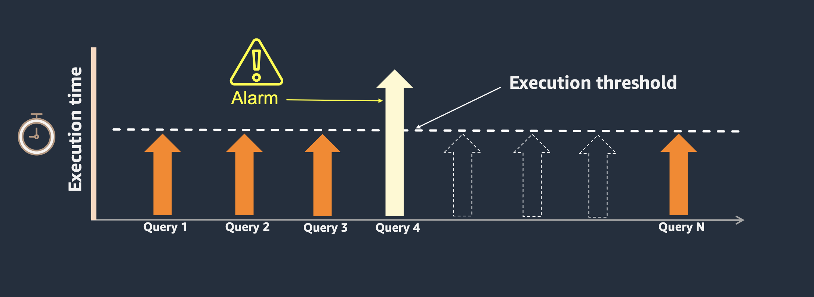
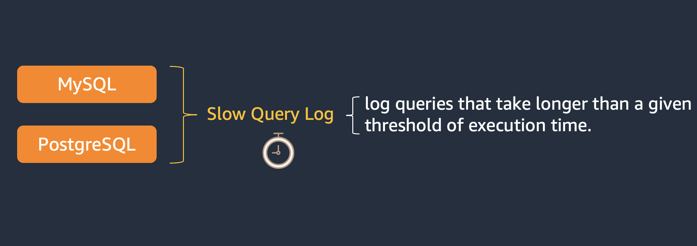
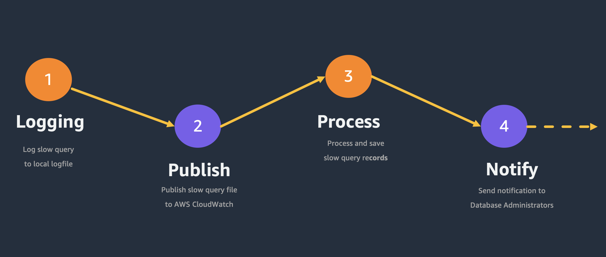
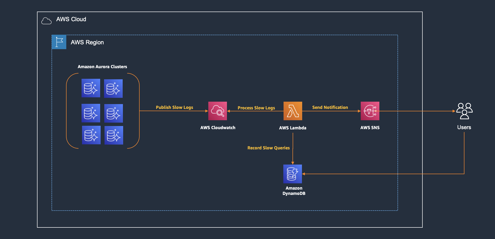

# SQL Query Governance for Amazon Aurora and AWS RDS

## What is SQL Query Governance?

- Automated mechanism to detect, record and notify database statements that take more than defined threshold execution value.
- This mechanism can be used to identify queries that take a long time to execute and are therefore candidates for optimization.
- Provide proactive alerting strategy to identify problematic queries that require immediate tune process before to cause a performance problem.

## Foundation

SQL Query Governance is supported by database slow query log mechanism, which consists a logging process of SQL statements that take more than some specific threshold to be executed. 
The slow query log can be used to find queries that take a long time to execute and are therefore candidates for optimization.

## Support

This solution has support for MySQL and PostgreSQL compatible engines.

Following parameters needs to be configured as part of this solution.

#### MySQL Paramaters

- **slow_query_log** = Value can be 0 (or OFF) to disable the slow query log or 1 (or ON) to enable the log

- **long_query_time** = Threshold to determine if a query is slow, value in seconds.

#### PostgreSQL Paramaters

- **log_min_duration_statement** = Value  set (units milliseconds) other than -1 (means disabled), logging all queries that take at least the specified number of milliseconds.

- **auto_explain.log_min_duration** = Log the execution plan of the queries whenever they take more time than the threshold

## How it works?

## Architecture

## Solution Deployment

> **Time to deploy:** Approximately 5 minutes.

### Launch CloudFormation Stack

Follow the step-by-step instructions to configure and deploy the SQL Query Governance into your account.

1. Make sure you have sign in AWS Console already.
1. Click the following button to launch the CloudFormation Console in your account and use Cloudformation template (SqlQueryGovernance.template) located on source folder.

1. Input **Stack name** parameter. 
1. Input **SubscriptionEmail** parameter. An email confirmation will be sent to this email from AWS SNS Service. You need to confirm this email.
1. Click **Next**, Click **Next**, select **acknowledge that AWS CloudFormation might create IAM resources with custom names**. and Click **Submit**.

## Solution Integration 

> **Time to integrate:** Approximately 1 minute.

Once solution has been deployed, last step is attach AWS Cloudwatch Logs to Lambda functions in order to process slow queries.

Follow the step-by-step instructions to attach AWS Cloudwatch log slow queries to SQL Query Governance solution.

1. Goto to Lambda function and click on Add Trigger
1. Select source as AWS Cloudwatch Logs
1. Select the Slow Query Log group for the AWS RDS or Amazon Aurora instance. ARN can be also used like this
 
    > arn:aws:logs:**AwsRegion**>:**AccountID**:log-group:/aws/rds/instance/**instance**/slowquery:*

1. Input the Filter name.
1. For MySQL set filter pattern as optional, for PostgreSQL set filter pattern to "duration:"
1. Click on Add button.
